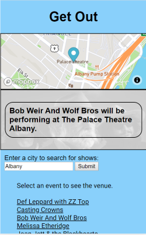
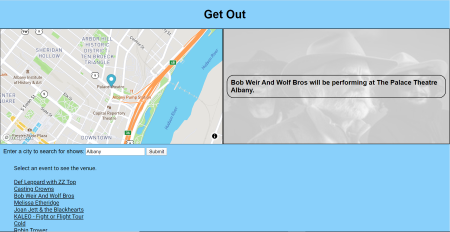

# Get Out
You can play around with a live version of the app here: https://ajlanza.github.io/GetOut/

Get Out asks the user for a city and then displays a list of shows scheduled for that area. 
The user can click an event and a map element will show where the venue is. A section of the page will also update with the name of the venue and an image of the band that the user clicked.

On mobile, the map is displayed over the venue name and band picture, and on bigger screens the details will be to the right of the map.

This app is built using HTML, CSS, JavaScript, and jQuery.
